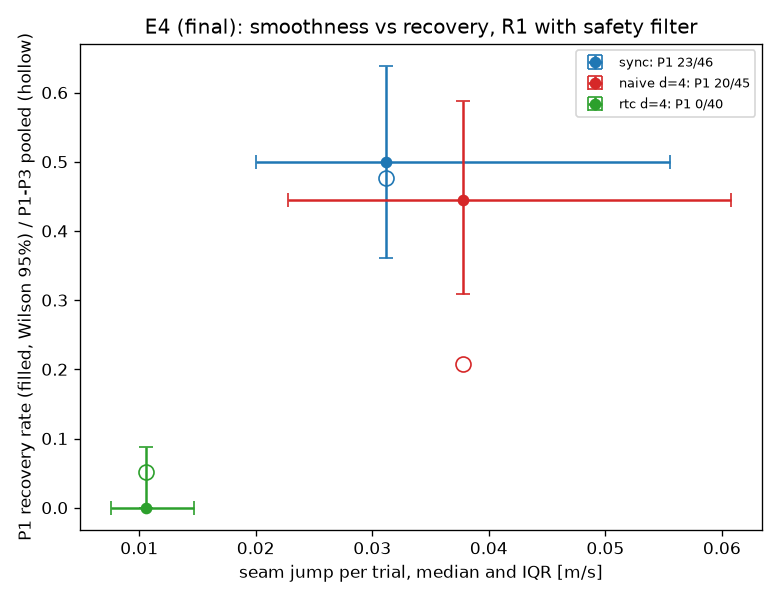

# 最終評価の結果（Step J）

このファイルは `scripts/53_results.py` が記録から作った（2026-09-28 16:45）。数字は手で書いていない。評価した版は凍結のタグ `stepJ-freeze`（df47611）。最終評価用の種の帯（110000〜）で回した。最終モデルは予備評価で決めた **R2**（以後変えない決まり）。予備は選択用の帯（199000〜）の値で、並べて示す。

## 1. 主要評価項目（予備評価の前に固めたもの）

| E | 比べるもの | 主な指標 | 最終評価 | p（McNemar） | 差の 95% 区間（ポイント） | 予備 |
|---|---|---|---|---|---|---|
| E1 | R2 の自然 | 成功率（Wilson） | 86/99（79〜92%） | — | — | 29/30 |
| E2 | R2 の P1 | 立ち直りの率（成立が分母） | 31/42（59〜85%） | — | — | 23/24 |
| E3 ① | 本線 R1 対 N1 | P1 の立ち直り | 44% 対 10%（16・3、39 対） | 0.0044、Holm 後 **0.0044** | +13〜+51 | Holm 後 0.0018 |
| E3 ② | sync R1 対 N1 | P1 の立ち直り | 48% 対 5%（20・1、44 対） | 2.1e-05、Holm 後 **4.2e-05** | +26〜+58 | Holm 後 2.4e-04 |
| E4 | naive 対 rtc（R1） | P1 の立ち直り | 49% 対 0%（19・0、39 対） | **3.8e-06** | +31〜+64 | p 6.1e-05 |
| E5 | R2 のフィルタあり対なし | 自然の接触の有無 | 5% 対 17%（1・13、99 対） | **0.0018** | -20〜-5 | p 1 |
| E8 | R2 対 R1+ | P1 の立ち直り | 73% 対 66%（9・6、41 対） | **0.61** | -11〜+25 | p 0.012 |
| E6 | R2、指示と手がかりを一緒に差し替え | 正答率（多数決） | 99/99（96〜100%） | — | — | 99/99 |

**予備と結論が逆になった項目**（主要評価項目のとおり、テスト用の値で結論を書く）

- **E8**: 2 段目の復帰デモ（R2）の効果は、R1+ に対して確かめられなかった（P1 73% 対 66%（9・6、41 対）、p 0.61）。予備の差（p 0.012）は、回すたびのばらつき（掲示板 0087: P1 で 30 対中 9 が入れ替わる）の範囲だったと読む
- **E5**: 安全フィルタで、失敗注入なしの接触は減った（5% 対 17%（1・13、99 対）、p 0.0018。予備は p 1 で差なし）。代償として、フィルタが接近を止め続けて失敗した試行が **2 本**あった（下の 2）

## 2. 失敗注入なし（自然）の成功と、安全フィルタの代償

| 組 | 方策・実行 | 自然の成功 | Wilson 95% |
|---|---|---|---|
| A | R1・本線 | 92/99 | 86〜97% |
| B | N1・本線 | 95/99 | 90〜98% |
| C | R1・sync | 96/99 | 91〜99% |
| D | N1・sync | 95/99 | 90〜98% |
| E | R1・rtc d=4 | 84/99 | 76〜91% |
| F | R2・本線 | 86/99 | 79〜92% |
| G | R1+・本線 | 94/99 | 89〜98% |
| H | R2・本線・フィルタ切 | 87/99 | 80〜93% |

**副次評価項目: 同じ種の対での自然の成功（McNemar、補正なし）**

| 比べるもの | 成功率（x だけ・y だけ） | p | 差の 95% 区間 |
|---|---|---|---|
| R2（F）対 R1+（G） | 87% 対 95%（2・10、99 対） | 0.039 | -16〜-1 |
| R2（F）対 R1（A） | 87% 対 93%（2・8、99 対） | 0.11 | -13〜+0 |

**R2 の自然の失敗 13 本の内訳**（失敗の検出器の最初に確定した形。フィルタが止め続けたものは別に数える）: grasp_miss 9、フィルタで停止 2、drop_table 2

| 種 | 目標 | 形 |
|---|---|---|
| 110001 | green | grasp_miss |
| 110003 | blue | grasp_miss |
| 110008 | green | grasp_miss |
| 110009 | red | grasp_miss |
| 110009 | green | grasp_miss |
| 110009 | blue | フィルタで停止（grasp_miss） |
| 110012 | red | grasp_miss |
| 110017 | red | drop_table |
| 110024 | red | grasp_miss |
| 110027 | blue | フィルタで停止（grasp_miss） |
| 110028 | blue | grasp_miss |
| 110029 | red | grasp_miss |
| 110031 | green | drop_table |

（grasp_miss＝掴み損ね、drop_table＝机への落下、drop_other＝その他の落下、timeout＝どれにも当たらず時間切れ）

**フィルタが接近を止め続けて失敗した試行**（E5。フィルタありで失敗・なしで成功し、フィルタが 5% 以上のこまで働いたもの）

| 種 | 目標 | 働いたこま | 働いたときに最も近かった障害物（目標を除く） | フィルタなしの同じ種 |
|---|---|---|---|---|
| 110009 | blue | 68/601（11%） | cube_green 68 こま | 成功（触れたもの: cube_green、cube_blue、wall_yn） |
| 110027 | blue | 95/601（16%） | cube_green 95 こま | 成功（触れたもの: cube_green、cube_blue） |

止め続けた相手（働いたときに最も近かった障害物）: 立方体。映像（映像のために同じ設定で回し直したもの）は `docs/media/2026-09-28_EFINAL/` の E5_*.mp4

## 3. 副次評価項目（補正なしの記述）

| 比べるもの | 自然の成功 | P2 の立ち直り | P3 の立ち直り | P1〜P3 の合計 |
|---|---|---|---|---|
| E3 本線（A 対 B） | 93% 対 96%（1・4、99 対）、p 0.38 | 6% 対 3%（2・1、33 対）、p 1 | 9% 対 2%（4・1、45 対）、p 0.38 | 20% 対 5%（22・5、117 対）、p 0.0015 |
| E3 sync（C 対 D） | 97% 対 96%（2・1、99 対）、p 1 | 18% 対 12%（4・2、34 対）、p 0.69 | 67% 対 41%（20・8、46 対）、p 0.036 | 47% 対 20%（44・11、124 対）、p 8.7e-06 |
| E4 naive 対 rtc（A 対 E） | 93% 対 85%（8・0、99 対）、p 0.0078 | 4% 対 0%（1・0、27 対）、p 1 | 9% 対 14%（4・6、44 対）、p 0.75 | 22% 対 5%（24・6、110 対）、p 0.0014 |
| E4 sync 対 naive（C 対 A） | 97% 対 93%（5・1、99 対）、p 0.22 | 21% 対 3%（6・1、29 対）、p 0.12 | 65% 対 7%（28・1、46 対）、p 1.1e-07 | 50% 対 20%（44・9、118 対）、p 1.2e-06 |
| E4 sync 対 rtc（C 対 E） | 97% 対 85%（13・1、99 対）、p 0.0018 | 24% 対 0%（7・0、29 対）、p 0.016 | 64% 対 14%（24・2、44 対）、p 1.0e-05 | 50% 対 5%（52・2、111 対）、p 1.6e-13 |
| E8（F 対 G） | 87% 対 95%（2・10、99 対）、p 0.039 | 9% 対 3%（3・1、32 対）、p 0.62 | 42% 対 7%（18・3、43 対）、p 0.0015 | 44% 対 27%（30・10、116 対）、p 0.0022 |
| E5（F 対 H） | 87% 対 88%（2・3、99 対）、p 1 | 9% 対 18%（2・5、34 対）、p 0.45 | 42% 対 37%（7・5、43 対）、p 0.77 | 44% 対 45%（13・14、119 対）、p 1 |

| 比べるもの | 継ぎ目の跳びの中央値 [m/s]（Wilcoxon p） | 躍度の中央値 [m/s³]（p） |
|---|---|---|
| E4 naive 対 rtc（A 対 E） | 0.038 対 0.011（1.3e-40） | 4.11 対 2.51（2.3e-36） |
| E4 sync 対 naive（C 対 A） | 0.031 対 0.038（0.92） | 4.32 対 4.11（5.3e-04） |
| E8（F 対 G） | 0.046 対 0.037（3.2e-08） | 5.02 対 4.09（9.1e-16） |
| E5（F 対 H） | 0.046 対 0.045（0.25） | 5.02 対 4.82（0.017） |

E4 の自然な失敗の形: C grasp_miss 2・drop_table 1、A drop_table 1・grasp_miss 6、E grasp_miss 12・drop_other 1・drop_table 2

P1 の反応時間は、対の数が少ない（手が 2 cm 近づかない試行は値がない）。R2 の P1 は、評価で制御が戻る「閉じた直後の低い姿勢」をほとんど覆っていない（掲示板 0078・0079）。

## 4. E6（指示の見分け、R2）

- 指示と手がかりを一緒に差し替え: 99/99（5 回ずつの試料で 100%、中間落ち 0.2%）
- 手がかりだけ差し替え: 手がかりに従う 100%、指示文に従う 0%

## 5. E7（上位層: LLM の分解・完了判定・複数手順の通し）

| 項目 | 基準 | 最終評価 | 判定 | 予備 |
|---|---|---|---|---|
| LLM の分解（最終用の 30 文、一度だけ） | 29/30 以上 | 29/30（83〜99%） | 届いた | 30/30（手直し用の文） |
| 完了判定（照合データ、正例 100・負例 100） | 98% 以上 | 194/200＝97.0%（94〜99%） | **届かなかった** | 197/200 |
| 複数手順の通し（「全部片付けて」、3 個とも） | 20 回中 10 以上（G3） | 10/20（30〜70%） | 届いた | 11/20（戻す動きを入れる前の実行器） |

LLM 単体（自前の検査の前）でも 29/30。期待する出力のとおりに数えた。外れた文（LLM の出力と返答の文をそのまま）:

- id 26「ひとつだけ箱に入れて」: 期待 []、出力 ["red"]、返答「赤い立方体を1個、箱に入れます。」

**完了判定の食い違い 6 件**（見逃し 6・誤って「完了」0）。種類ごとの一致: run_positive 30/35、placed_inside 64/64、run_held_over_box 34/35、placed_rim 32/32、placed_beside 34/34

- 116010 green run_positive: 真値 箱の中・判定 まだ（待機位置から 3.3 cm、条件がそろって 0.20 s、指 開）
- 116027 red run_positive: 真値 箱の中・判定 まだ（待機位置から 4.6 cm、条件がそろって 0.45 s、指 開）
- 116027 red run_held_over_box: 真値 箱の中・判定 まだ（待機位置から 20.4 cm、条件がそろって 0.00 s、指 閉）
- 116030 red run_positive: 真値 箱の中・判定 まだ（待機位置から 5.3 cm、条件がそろって 0.00 s、指 開）
- 116034 green run_positive: 真値 箱の中・判定 まだ（待機位置から 5.0 cm、条件がそろって 0.05 s、指 開）
- 116036 green run_positive: 真値 箱の中・判定 まだ（待機位置から 5.8 cm、条件がそろって 0.00 s、指 開）

- 食い違いはすべて見逃し（安全側の誤り）で、実際の影響は判定が遅れること。走行の正例の見逃しは、取った時刻（真値の成功から 3.5〜6 s）に手がまだ待機位置へ戻り切っていなかったもの。閾値は学習用の帯だけで決めた値のまま変えていない
- **限界**: 照合データの負例の種類（持って箱の上・箱の縁・箱の脇）に「別の立方体の上に乗った」がない。複数手順の通しでは、この形の誤った「完了」が失敗 10 本のうち 5 本を占めた。照合データの一致率は、この誤りを測っていない

**複数手順の通し（115000〜115019）の内訳**

| 種 | 結果 | 種 | 結果 |
|---|---|---|---|
| 115000 | ok+r2 | 115010 | x:b+r2 |
| 115001 | G2 | 115011 | ok |
| 115002 | x:b | 115012 | ok |
| 115003 | B3+r2 | 115013 | B3+r1 |
| 115004 | x:b | 115014 | G2 |
| 115005 | ok+r2 | 115015 | G2 |
| 115006 | ok+r1 | 115016 | ok |
| 115007 | ok+r3 | 115017 | ok |
| 115008 | B3+r1 | 115018 | ok+r2 |
| 115009 | x:b | 115019 | ok |

（ok＝3 個とも、G2＝2 番目の緑で止まった、x:b＝判定は完了だが青が真値で箱に入っていない、+r2＝2 番目の手順がやり直しで完了）

- 1:red: 止まった 0/20（真値でも置けなかった 0）
- 2:green: 止まった 3/20（真値でも置けなかった 3）
- 3:blue: 止まった 3/17（真値でも置けなかった 3）
- やり直しで完了した手順 9。待機位置へ戻す動き 19 回（やり直しの前 15・置いた後 4）、着かなかった 0、触れた 1、置いた後に戻して判定が出た 3/4
- 戻す動きの始めに指を開いた 3 回のうち、立方体を挟んでいた 2（持ち上がっていた 1、別の色 0）。落ちた先: table 2
- 別の立方体の上に乗った誤った「完了」: 5 件（通しの数で 5/20、3 番目まで進んだ通し 17）
- 真値の成功から判定までの中央値 2.6 s、1 回の通しは模擬の時間で中央値 77 s

**待機位置へ戻す動き（予備評価の結果を見た後に加えた変更、掲示板 0094〜0096）**

- 検証（197000〜197019、3 通りの順番）で 3 個とも 31/60 → 41/60。この値は変更のきっかけと同じ種で測ったもので、楽観側に偏りうる
- 同じ種の対で、失敗 → 成功 16、成功 → 失敗 6（回すたびのばらつきは P1 で 30 対中 9 が入れ替わる程度＝0087。検定は付けない）
- テスト用の種では、戻す動きを入れた実行器で 10/20。入れる前の実行器ではこの種を回していない

